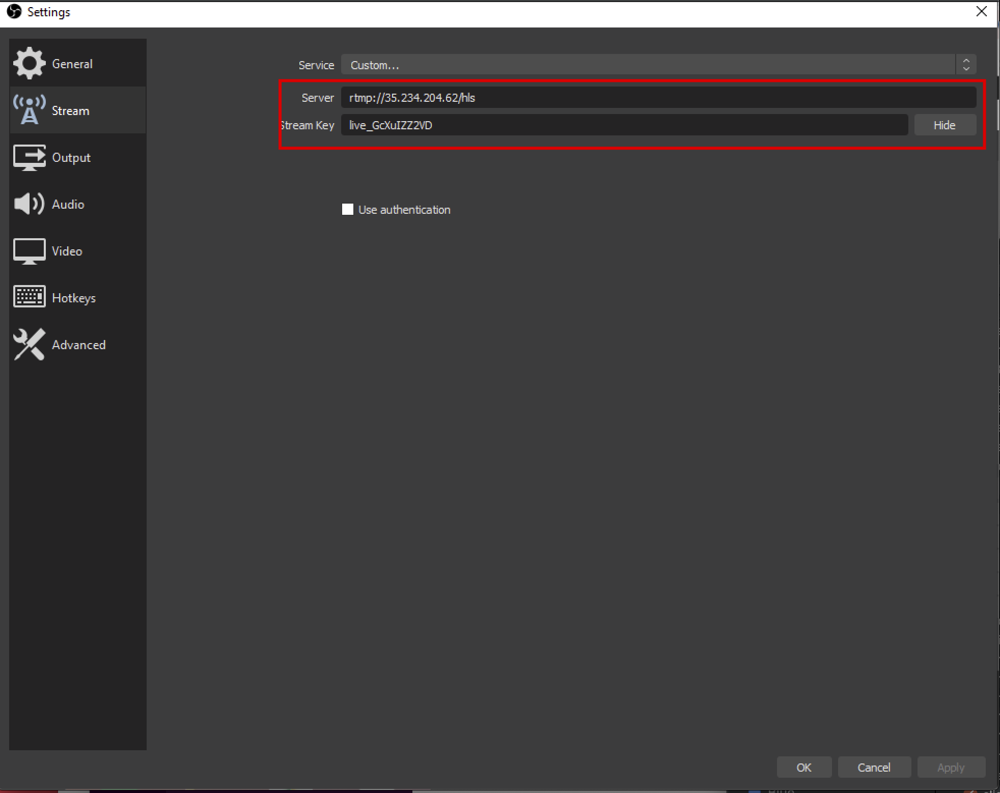

# Sample Use Case


**Step 1** - Use API to Create an event

cURL
```json
POST /api/v5/live/entities HTTP/1.1
Host: https://v5.dev.uizadev.io
Content-Type: application/json
Postman-Token: bdb18545-136c-4682-825b-bafa24c9c9b9,73388e62-e49c-4e55-ae78-7cd98d1b9329
cache-control: no-cache,no-cache
User-Agent: PostmanRuntime/7.17.1
Accept: */*
Host: 18.139.66.78:8080
Accept-Encoding: gzip, deflate
Content-Length: 181
Connection: keep-alive
 
{
    "name": "Yann event",
    "region": "asia-southeast-1",
    "description": "Event for Test",
    "app_id": "uiza",
    "user_id": "uiza"
}
```

API response
```json
{
    "id": "0d980664-b56e-4068-81ad-29d576419a1c",
    "user_id": "uiza",
    "app_id": "uiza",
    "name": "Yann event",
    "description": "Event for Test",
    "region": "asia-southeast-1",
    "status": "init",
    "created_at": "2019-10-01T03:22:37Z",
    "updated_at": "2019-10-01T03:22:37Z"
}
```

**Step 2** - Get the Stream key & Stream URL


cURL
```json
GET /api/v5/live/entities/0d980664-b56e-4068-81ad-29d576419a1c HTTP/1.1
Host: https://v5.dev.uizadev.io
Accept: */*
Accept-Encoding: gzip, deflate
Cache-Control: no-cache
Connection: keep-alive
Host: 18.139.162.153:8080
Postman-Token: 7b05b93c-e4fb-49c9-8dd2-19f70c94ed7d,51fd99e8-b0f9-40ed-9bb4-9545a928c46d,516d3247-ae21-48dc-8b7b-6188c2e9f1c9
User-Agent: PostmanRuntime/7.16.3
cache-control: no-cache,no-cache
```

API response
```json
{
    "id": "0d980664-b56e-4068-81ad-29d576419a1c",
    "user_id": "uiza",
    "app_id": "uiza",
    "name": "Yann event",
    "description": "Event for Test",
    "stream_url": "rtmp://35.234.204.131/hls",
    "stream_key": "live_aCNAuDnBD5",
    "region": "asia-southeast-1",
    "status": "ready",
    "created_at": "2019-10-01T03:22:37Z",
    "updated_at": "2019-10-01T03:22:37Z"
}
```

**Step 3** - Download one of the capture software

OBS: https://obsproject.com/

Golightstream: https://studio.golightstream.com/welcome

Streamlab: https://streamlabs.com/

Larix: https://play.google.com/store/apps/details?id=com.wmspanel.larix_broadcaster&hl=en


**Step 4** - Input the Streamkey & Stream URL to Capture Software



**Step 5** - Get the Link play & preview your stream

Currently, we provide the link play by the format

http://{{ip}}:8080/hls/{{stream_key}}/index.m3u8

Let change the information

- IP: the IP returned in stream_url
- stream_key: returned in stream_key