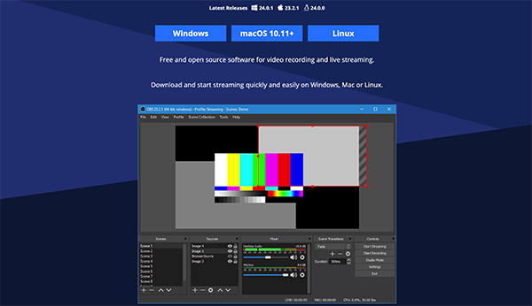
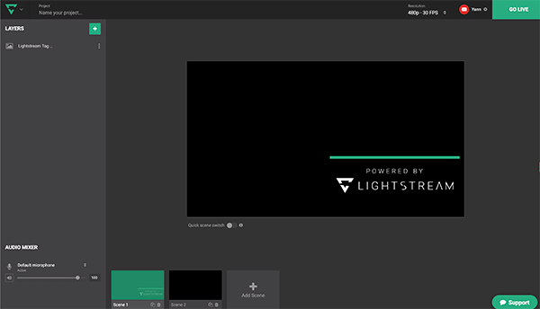
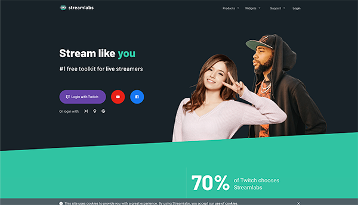

# How to start a live stream with Uiza Stream Key and Stream URL

Currently, Uiza is not provide the Capture Software to get the signal, but you can easily get a Software by the list below

**OBS**: https://obsproject.com/ for Window - macOS 10.11+ - Linux

**Golightstream:** https://studio.golightstream.com/welcome for Chrome browser

**Streamlab:** https://streamlabs.com/ for Windows - iOS - Android

**Larix:** https://play.google.com/store/apps/details?id=com.wmspanel.larix_broadcaster&hl=en for iOS - Android

