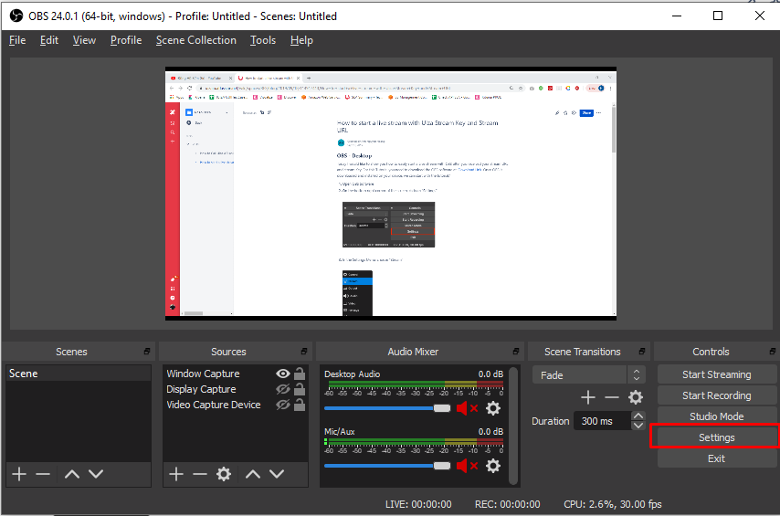
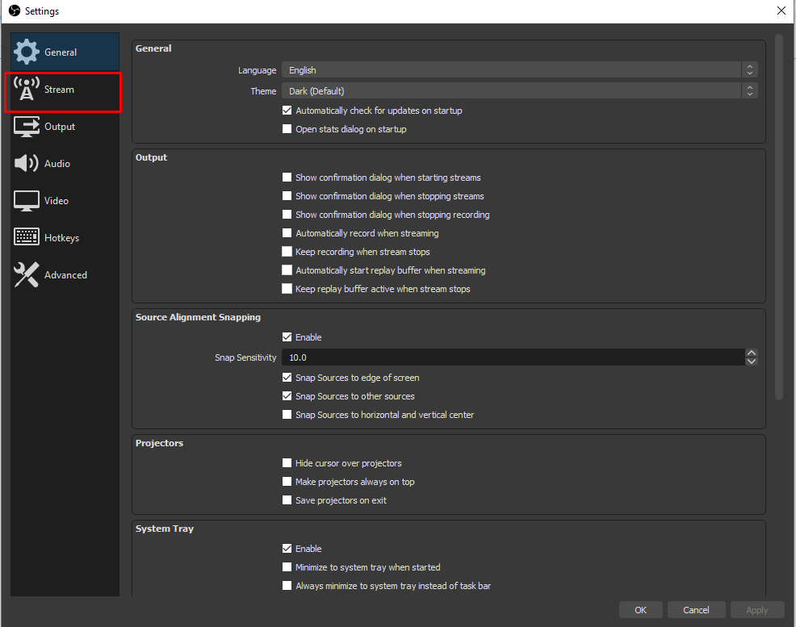
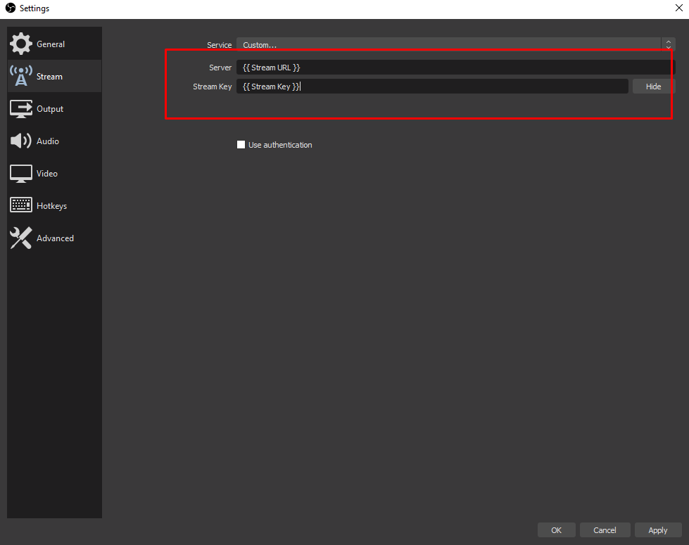
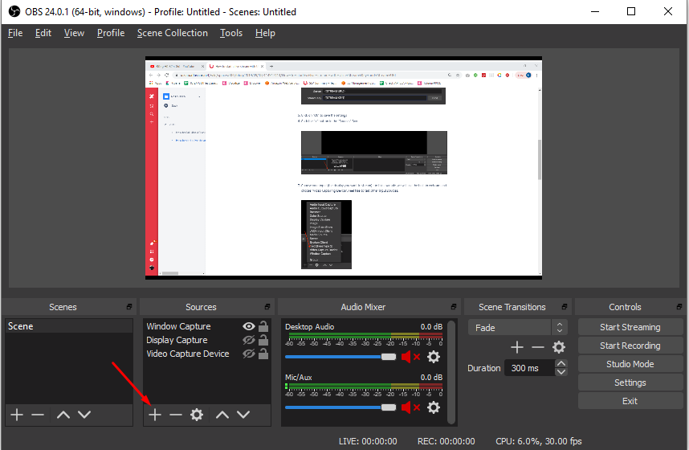
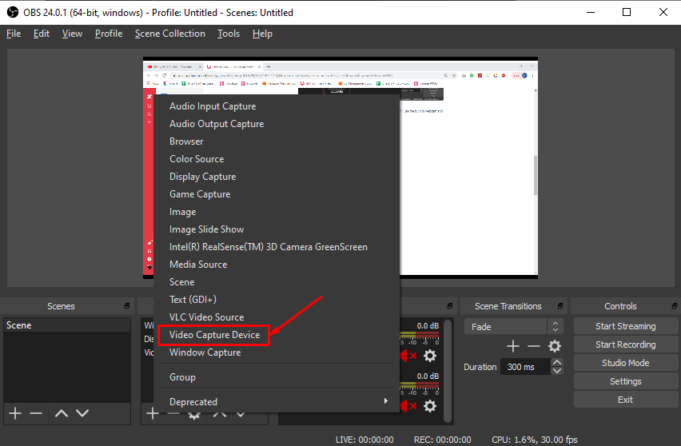
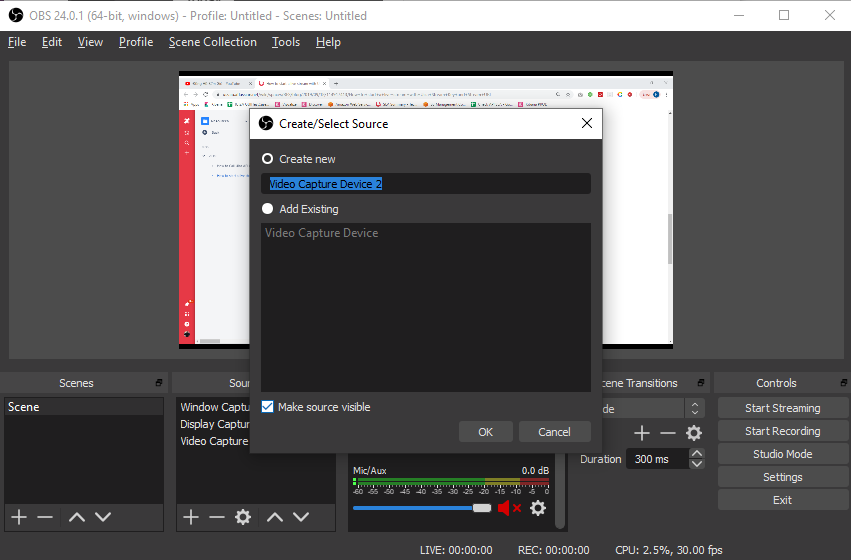
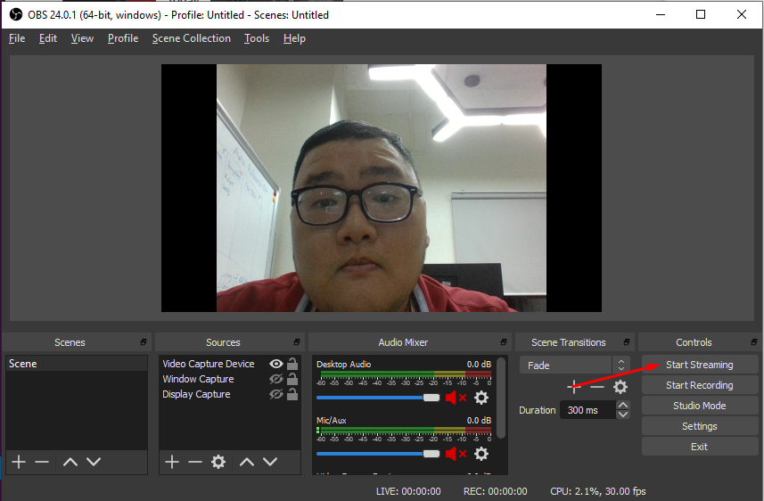

# OBS Guideline

Today I would like to show you how to easily start a Live stream with OBS after you received your stream URL and stream Key. For this Tutorial you need to download the OBS software at: https://obsproject.com/. Once OBS is downloaded and installed on your device, we can start with the tutorial/

1. Open OBS Software

2. On the bottom right cornor of the screen, click on “Settings"

3. In the Settings Menu, choose “Stream" & choose Service = "Custom"

4. Input your Stream URL in the “Server” box and your Stream key in the “Stream Key Box" & Click on “Ok” to save the settings

5. Click the “+” button In the “Sources” Box

6. Choose your input (the display you want to stream) - in this example, we will use the built in webcam and choose “Video Capturing Device”. Feel free to test other input sources.

7. Choose a name for your input source and click on “Ok"

8. Click in “Devices” to choose from your available input sources, then click on “OK"

9. Now you can click on **“Start Streaming”** in the bottom right corner

With these steps your Live Stream can officially be played on supporting players.
