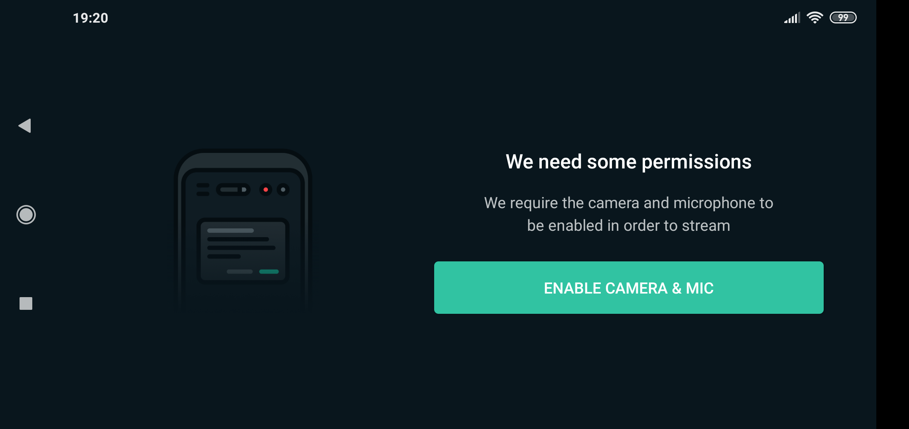

# Streamlab Guideline

Download Streamlabs at this Link: https://streamlabs.com/streamlabs-obs

1. Open Streamlabs and click on “Other Platforms"

2. Enter your Stream URL into the “RTMP URL” field and your Stream Key into the “Stream Key” field

3. Enable your Camera and Mic

4. Start your stream
